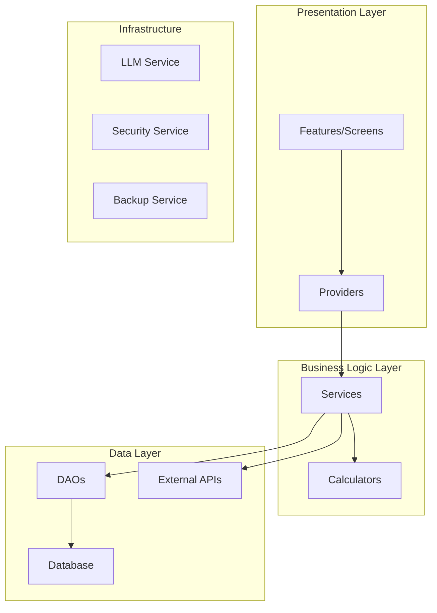

# WealthLens Architectural Improvements Plan

## Current Architecture Assessment

### Strengths
- **Feature-based organization**: Clear separation of concerns with features/, services/, providers/, data/
- **Modern stack**: Flutter + Riverpod + Drift + GoRouter is a solid foundation
- **Comprehensive data model**: Supports multiple asset classes (equity, crypto, real estate, insurance, etc.)
- **Security features**: Biometric authentication, database encryption, secure storage
- **External integrations**: Multiple API integrations (Yahoo Finance, CoinGecko, Finnhub, AMFI)
- **LLM integration**: Flexible LLM service abstraction with multiple provider support

### Issues Identified

#### 1. Code Quality Issues
- Numerous linting errors/warnings (unused imports, deprecated methods, type inference failures)
- Undefined identifiers in UI screens ('activeLlmProvider', 'llmProvider')
- Unawaited futures in import_screen.dart
- Inconsistent error handling patterns

#### 2. Security Gaps
- Backup encryption incomplete (TODO in backup_service.dart)
- API keys stored in settings (good) but no rotation mechanism
- No certificate pinning for API calls
- Limited input validation in some services

#### 3. Performance Concerns
- Dashboard data provider computes currency conversions and asset allocation synchronously
- No caching strategy for price feeds
- No pagination for large datasets
- Potential memory leaks in long-running services

#### 4. Testing Coverage
- Good unit test coverage for core models (Money) and DAOs
- Missing integration tests for services
- No UI/widget tests
- No performance/load testing

#### 5. Architectural Debt
- Tight coupling between providers and services
- No clear separation between business logic and presentation
- Mixed responsibilities in some services
- No dependency injection framework

## Recommended Architectural Improvements

### 1. Code Quality & Maintainability

#### 1.1 Fix Linting Issues
```yaml
Action: Run `dart fix --apply` and address remaining warnings
Priority: High
Impact: Improved code quality, reduced technical debt
```

#### 1.2 Implement Consistent Error Handling
```yaml
Action: Create unified error handling pattern with Result/Either types
Priority: Medium
Impact: Better error recovery, improved user experience
```

#### 1.3 Add Code Analysis CI Pipeline
```yaml
Action: Set up GitHub Actions for static analysis
Priority: Medium
Impact: Prevent regression, enforce code standards
```

### 2. Security Enhancements

#### 2.1 Complete Backup Encryption
```yaml
Action: Implement AES-256 encryption for backup files
Priority: High
Impact: Secure user data at rest
```

#### 2.2 Implement API Key Rotation
```yaml
Action: Add key rotation mechanism for external APIs
Priority: Medium
Impact: Reduced security risk from compromised keys
```

#### 2.3 Add Certificate Pinning
```yaml
Action: Implement certificate pinning for financial APIs
Priority: Medium
Impact: Prevent MITM attacks
```

#### 2.4 Input Validation Layer
```yaml
Action: Create validation service for all user inputs
Priority: Low
Impact: Prevent injection attacks, data corruption
```

### 3. Performance Optimization

#### 3.1 Implement Caching Strategy
```yaml
Action: Add caching layer for price feeds and FX rates
Priority: High
Impact: Reduced API calls, improved responsiveness
```

#### 3.2 Optimize Dashboard Data Provider
```yaml
Action: Move heavy computations to isolates/background threads
Priority: High
Impact: Smoother UI, better performance with large portfolios
```

#### 3.3 Add Pagination
```yaml
Action: Implement pagination for holdings and transactions
Priority: Medium
Impact: Better performance with large datasets
```

#### 3.4 Memory Management
```yaml
Action: Add memory monitoring and cleanup for long-running services
Priority: Low
Impact: Reduced memory leaks, better stability
```

### 4. Testing Strategy

#### 4.1 Expand Test Coverage
```yaml
Action: Add integration tests for all services
Priority: High
Impact: Better reliability, easier refactoring
```

#### 4.2 Add UI/Widget Tests
```yaml
Action: Implement widget tests for critical screens
Priority: Medium
Impact: UI regression prevention
```

#### 4.3 Performance Testing
```yaml
Action: Add benchmark tests for critical operations
Priority: Low
Impact: Performance regression detection
```

### 5. Architectural Refactoring

#### 5.1 Implement Clean Architecture
```yaml
Action: Refactor to Clean Architecture layers (Domain, Data, Presentation)
Priority: High
Impact: Better separation of concerns, easier testing
```

#### 5.2 Add Dependency Injection
```yaml
Action: Implement proper DI (get_it + injectable)
Priority: Medium
Impact: Reduced coupling, easier testing
```

#### 5.3 Create Service Interfaces
```yaml
Action: Define interfaces for all services
Priority: Medium
Impact: Better abstraction, easier mocking
```

#### 5.4 Event-Driven Architecture
```yaml
Action: Implement event bus for cross-feature communication
Priority: Low
Impact: Loose coupling, better scalability
```

### 6. Data Layer Improvements

#### 6.1 Database Migration Strategy
```yaml
Action: Implement proper migration handling for schema changes
Priority: Medium
Impact: Seamless updates, data integrity
```

#### 6.2 Offline-First Support
```yaml
Action: Enhance offline capabilities with sync queue
Priority: Medium
Impact: Better user experience in poor connectivity
```

#### 6.3 Data Validation
```yaml
Action: Add schema validation for imported data
Priority: Low
Impact: Data quality, consistency
```

### 7. UI/UX Architecture

#### 7.1 Design System
```yaml
Action: Create consistent design system with theme extensions
Priority: Medium
Impact: Consistent UI, easier maintenance
```

#### 7.2 State Management Refinement
```yaml
Action: Review and optimize Riverpod provider hierarchy
Priority: Low
Impact: Better performance, simpler state management
```

#### 7.3 Navigation Improvements
```yaml
Action: Add deep linking and navigation state persistence
Priority: Low
Impact: Better user experience
```

## Implementation Roadmap

### Phase 1: Foundation (Weeks 1-2)
1. Fix critical linting issues
2. Complete backup encryption
3. Implement caching for price feeds
4. Add basic integration tests

### Phase 2: Architecture Refactoring (Weeks 3-4)
1. Implement Clean Architecture structure
2. Add dependency injection
3. Create service interfaces
4. Optimize dashboard data provider

### Phase 3: Security & Performance (Weeks 5-6)
1. Implement certificate pinning
2. Add API key rotation
3. Implement pagination
4. Add memory management

### Phase 4: Testing & Polish (Weeks 7-8)
1. Expand test coverage
2. Add UI/widget tests
3. Implement design system
4. Add offline-first support

## Technical Decisions

### 1. Caching Strategy
- Use `dio_cache_interceptor` for HTTP caching
- Implement `flutter_cache_manager` for file caching
- Add `hive` for local data caching

### 2. Error Handling Pattern
- Use `dartz` package for Either/Result pattern
- Create custom error types for domain errors
- Implement global error handler

### 3. Dependency Injection
- Use `get_it` + `injectable` for DI
- Generate service locator with build_runner
- Support different environments (dev, prod, test)

### 4. Testing Framework
- `flutter_test` for unit/widget tests
- `mockito` for mocking
- `integration_test` for integration tests
- `benchmark_harness` for performance tests

### 5. Code Generation
- Continue using `drift` for database
- Use `freezed` for immutable data classes
- Use `json_serializable` for serialization

## Risk Assessment

### High Risk
- Breaking changes to database schema
- Performance issues with large portfolios
- Security vulnerabilities in backup/restore

### Medium Risk
- Refactoring breaking existing functionality
- Third-party API changes
- State management complexity

### Low Risk
- UI/UX consistency issues
- Minor performance optimizations
- Testing coverage gaps

## Success Metrics

### Code Quality
- Zero linting warnings/errors
- 80%+ test coverage
- Static analysis score > 4.0

### Performance
- Dashboard load time < 2 seconds
- Memory usage < 200MB for 1000+ holdings
- API response caching hit rate > 70%

### Security
- All sensitive data encrypted at rest
- Certificate pinning implemented
- No security vulnerabilities in static analysis

### Maintainability
- Clear separation of concerns
- Dependency injection implemented
- Comprehensive documentation

## Next Steps

1. Review this plan with the development team
2. Prioritize Phase 1 items for immediate implementation
3. Create detailed technical specifications for each improvement
4. Set up tracking for implementation progress
5. Schedule regular architecture review meetings

## Appendix

### Current Architecture Diagram


### Target Architecture Diagram
```mermaid
graph TB
    subgraph "Presentation Layer"
        A1[Widgets] --> A2[ViewModels]
        A2 --> A3[State Management]
    end
    
    subgraph "Domain Layer"
        B1[Use Cases] --> B2[Entities]
        B3[Repository Interfaces]
    end
    
    subgraph "Data Layer"
        C1[Repositories] --> C2[DAOs]
        C2 --> C3[Database]
        C1 --> C4[API Clients]
        C4 --> C5[External APIs]
    end
    
    subgraph "Infrastructure Layer"
        D1[Dependency Injection]
        D2[Error Handling]
        D3[Caching]
        D4[Security]
    end
    
    A3 --> B1
    B1 --> C1
    B3 --> C1
    D1 --> A2
    D1 --> B1
    D1 --> C1