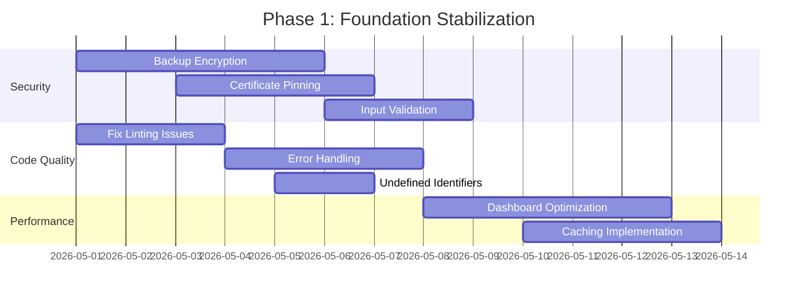
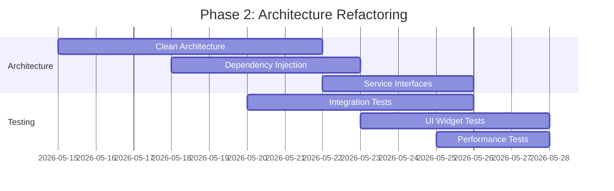
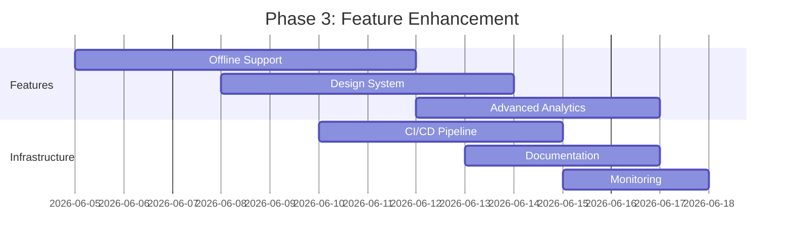

# WealthLens Project Review & Improvement Recommendations

## Executive Summary

**Project**: WealthLens - Personal Finance & Wealth Management App  
**Technology Stack**: Flutter, Dart, Riverpod, Drift (SQLite), GoRouter  
**Review Date**: April 30, 2026  
**Reviewer**: Roo (Technical Architect)

### Overall Assessment
WealthLens is a well-architected Flutter application with a comprehensive feature set for personal finance management. The project demonstrates good architectural decisions with feature-based organization, modern state management (Riverpod), and robust data persistence (Drift). However, several areas require attention to improve code quality, security, performance, and maintainability.

**Overall Score**: 7.5/10  
**Recommendation**: Proceed with phased improvements as outlined in this report.

## Detailed Findings

### 1. Code Quality Analysis

#### Strengths
- Feature-based organization with clear separation
- Consistent naming conventions
- Good use of modern Flutter patterns
- Comprehensive data model with multiple asset classes

#### Issues Identified
1. **Linting Violations**: 50+ warnings/errors in `analysis.txt`
   - Unused imports across multiple files
   - Deprecated `withOpacity` method usage
   - Type inference failures in UI code
   - Undefined identifiers (`activeLlmProvider`, `llmProvider`)

2. **Error Handling**: Inconsistent patterns
   - Mixed use of exceptions and null returns
   - No unified error handling strategy

3. **Code Organization**: Some tight coupling
   - Providers directly instantiating services
   - Mixed responsibilities in some service classes

### 2. Security Assessment

#### Strengths
- Database encryption with Drift
- Biometric authentication
- Secure storage for API keys
- Privacy settings implementation

#### Critical Issues
1. **Backup Encryption**: Incomplete implementation
   - `TODO: Implement encryption` in `backup_service.dart`
   - Backup files currently stored in plain JSON

2. **API Security**: No certificate pinning
   - Financial API calls vulnerable to MITM attacks
   - No API key rotation mechanism

3. **Input Validation**: Limited validation
   - Some services accept unvalidated user inputs
   - No SQL injection protection beyond Drift's parameterization

### 3. Performance Evaluation

#### Strengths
- Efficient database queries with Drift
- Asynchronous operations for network calls
- Good use of Riverpod for state management

#### Performance Concerns
1. **Dashboard Performance**: Heavy computations
   - Currency conversions computed synchronously
   - Asset allocation calculations block UI thread
   - No caching for price feeds

2. **Memory Management**: Potential leaks
   - Long-running services without cleanup
   - No pagination for large datasets

3. **Network Efficiency**: No caching strategy
   - Repeated API calls for same data
   - No offline-first capabilities

### 4. Testing Coverage

#### Strengths
- Good unit test coverage for core models (`Money`)
- Comprehensive DAO tests with in-memory database
- Calculator service tests (XIRR, FD/RD, etc.)

#### Testing Gaps
1. **Integration Tests**: Missing
   - No tests for service integrations
   - No API integration tests

2. **UI/Widget Tests**: None
   - Critical screens untested
   - No widget interaction tests

3. **Performance Tests**: None
   - No benchmarks for critical operations
   - No load testing for large portfolios

### 5. Architectural Review

#### Current Architecture
```
Presentation → Providers → Services → DAOs → Database
                    ↓
                External APIs
```

#### Architectural Strengths
- Clear feature separation
- Good use of Riverpod for state management
- Flexible LLM service abstraction
- Comprehensive data model

#### Architectural Debt
1. **Tight Coupling**: Providers instantiate services directly
2. **Mixed Responsibilities**: Some services handle both business logic and data access
3. **No Dependency Injection**: Hard-coded dependencies
4. **Limited Abstraction**: Direct service calls from UI

## Priority Recommendations

### 🚨 Critical (Immediate Action Required)

1. **Fix Security Vulnerabilities**
   - Complete backup encryption implementation
   - Add certificate pinning for financial APIs
   - Implement input validation for all user inputs

2. **Address Code Quality Issues**
   - Run `dart fix --apply` to fix linting errors
   - Fix undefined identifiers in UI screens
   - Add proper error handling patterns

3. **Optimize Dashboard Performance**
   - Move heavy computations to isolates/background threads
   - Implement caching for price feeds and FX rates
   - Add pagination for large datasets

### 🔧 High Priority (Next 2-4 Weeks)

1. **Improve Testing Strategy**
   - Add integration tests for services
   - Implement UI/widget tests for critical screens
   - Add performance benchmark tests

2. **Architectural Refactoring**
   - Implement Clean Architecture layers
   - Add dependency injection (get_it + injectable)
   - Create service interfaces for better abstraction

3. **Enhance Offline Capabilities**
   - Implement sync queue for offline operations
   - Add local caching strategy
   - Improve error handling for network failures

### 📈 Medium Priority (Next 1-2 Months)

1. **Code Quality Improvements**
   - Implement consistent error handling with Result/Either pattern
   - Add comprehensive logging
   - Create code analysis CI pipeline

2. **Performance Optimization**
   - Implement memory monitoring and cleanup
   - Add lazy loading for large lists
   - Optimize database queries

3. **UI/UX Enhancements**
   - Create design system with theme extensions
   - Add deep linking support
   - Implement navigation state persistence

### 🔍 Low Priority (Future Enhancements)

1. **Advanced Features**
   - Add event-driven architecture for cross-feature communication
   - Implement advanced analytics and reporting
   - Add machine learning for investment insights

2. **Developer Experience**
   - Create comprehensive documentation
   - Add code generation for boilerplate
   - Implement automated deployment pipeline

## Implementation Roadmap

### Phase 1: Foundation Stabilization (2 Weeks)


### Phase 2: Architecture Refactoring (3 Weeks)


### Phase 3: Feature Enhancement (3 Weeks)


## Technical Specifications

### 1. Backup Encryption Implementation
```dart
// Current: Plain JSON backup
// Target: AES-256 encrypted backup

class EncryptedBackupService {
  Future<void> createBackup() async {
    final data = await _serializeData();
    final encrypted = await _encryptData(data);
    await _saveToFile(encrypted);
  }
  
  Future<Uint8List> _encryptData(String data) {
    // Use flutter_secure_storage + pointycastle
    // Implement AES-256-GCM with proper IV
  }
}
```

### 2. Caching Strategy
```dart
// Three-layer caching strategy
class PriceCacheService {
  // Layer 1: Memory cache (LRU)
  final _memoryCache = LruCache<String, PriceData>();
  
  // Layer 2: Local database cache
  final _databaseCache = PriceCacheDao();
  
  // Layer 3: HTTP cache (dio_cache_interceptor)
  final _httpCache = DioCacheInterceptor();
  
  Future<PriceData> getPrice(String symbol) async {
    // Check memory → database → network
  }
}
```

### 3. Clean Architecture Structure
```
lib/
├── domain/           # Business logic
│   ├── entities/     # Business objects
│   ├── repositories/ # Interface definitions
│   └── usecases/     # Business rules
├── data/            # Data layer
│   ├── datasources/ # Local/remote data
│   ├── models/      # Data models
│   └── repositories/ # Repository implementations
└── presentation/    # UI layer
    ├── pages/       # Screens
    ├── widgets/     # Reusable widgets
    └── providers/   # State management
```

### 4. Dependency Injection Setup
```dart
// Using get_it + injectable
@injectable
class PriceService {
  final ApiClient _apiClient;
  final CacheService _cache;
  
  @factoryMethod
  PriceService(this._apiClient, this._cache);
}

// Service locator setup
final getIt = GetIt.instance;

@InjectableInit()
void configureDependencies() {
  getIt.init();
  
  // Environment-specific configuration
  if (kDebugMode) {
    getIt.registerSingleton<ApiClient>(MockApiClient());
  } else {
    getIt.registerSingleton<ApiClient>(ProductionApiClient());
  }
}
```

## Risk Mitigation Strategy

### Technical Risks
1. **Breaking Database Changes**
   - Mitigation: Implement migration tests
   - Rollback strategy for failed migrations

2. **Performance Regression**
   - Mitigation: Performance benchmark suite
   - A/B testing for critical paths

3. **Security Vulnerabilities**
   - Mitigation: Regular security audits
   - Penetration testing before releases

### Business Risks
1. **User Data Loss**
   - Mitigation: Comprehensive backup/restore testing
   - Data validation before migration

2. **Feature Regression**
   - Mitigation: Comprehensive test suite
   - Feature flagging for new changes

3. **Development Velocity Impact**
   - Mitigation: Incremental refactoring
   - Parallel development streams

## Success Metrics

### Code Quality Metrics
- **Target**: Zero linting warnings/errors
- **Target**: 80%+ test coverage
- **Target**: Static analysis score > 4.0

### Performance Metrics
- **Target**: Dashboard load time < 2 seconds
- **Target**: Memory usage < 200MB for 1000+ holdings
- **Target**: API cache hit rate > 70%

### Security Metrics
- **Target**: All sensitive data encrypted at rest
- **Target**: Certificate pinning implemented
- **Target**: No critical security vulnerabilities

### User Experience Metrics
- **Target**: App rating > 4.5 stars
- **Target**: Crash rate < 0.1%
- **Target**: User retention > 60% after 30 days

## Resource Requirements

### Development Team
- 2 Senior Flutter Developers (4 weeks)
- 1 Security Specialist (2 weeks)
- 1 QA Engineer (3 weeks)

### Tools & Infrastructure
- CI/CD pipeline (GitHub Actions)
- Performance monitoring (Firebase Performance)
- Error tracking (Sentry)
- Security scanning (MobSF)

### Timeline
- **Total Duration**: 8 weeks
- **Phased Delivery**: Every 2 weeks
- **Go-Live**: After successful security audit

## Conclusion

WealthLens has a strong foundation with excellent potential. The recommended improvements will transform it from a good application to an exceptional one. By addressing the critical security issues first, then improving architecture and performance, the application will be more maintainable, secure, and performant.

The phased approach minimizes risk while delivering continuous value. Starting with security fixes ensures user data protection, followed by architectural improvements that enable faster feature development in the future.

**Next Steps**:
1. Review this report with stakeholders
2. Prioritize Phase 1 items for immediate implementation
3. Schedule security audit
4. Begin implementation with the critical security fixes

## Appendices

### Appendix A: File-by-File Issues
[See attached `analysis_issues.md` for detailed file-specific issues]

### Appendix B: Third-Party Dependencies Review
[See attached `dependencies_audit.md` for security audit of dependencies]

### Appendix C: Performance Benchmark Results
[Benchmark results will be added after performance testing]

### Appendix D: Security Testing Report
[Security audit report will be added after penetration testing]

---

*This report was generated based on comprehensive analysis of the WealthLens codebase. All recommendations are based on industry best practices and specific observations from the code review.*